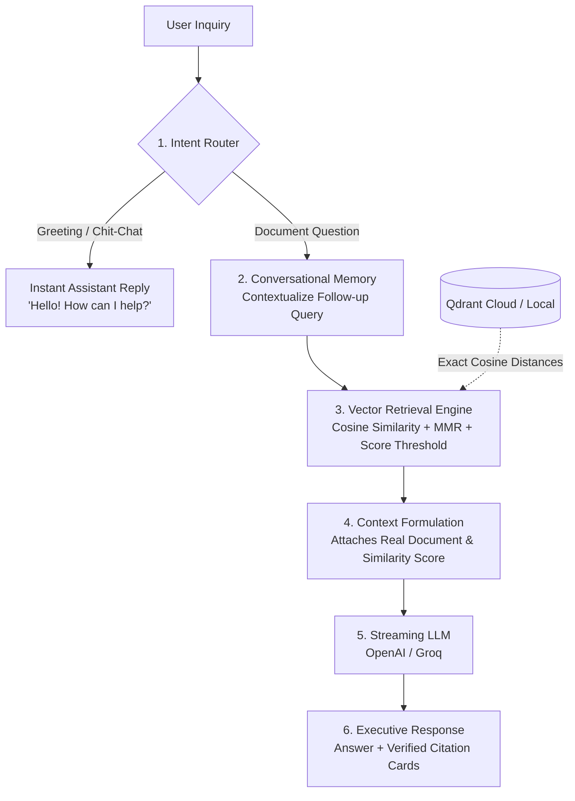

# ⚡ NexusAI — Enterprise Knowledge & Document Intelligence Platform

NexusAI is a production-grade, white-label **Retrieval-Augmented Generation (RAG)** platform designed for enterprise document search, policy question-answering, and knowledge intelligence. Built with **Streamlit**, **LangChain (LCEL)**, **HuggingFace**, and **Qdrant Vector Database**.

---

## 🌟 Enterprise Features

- **Smart Intent Router (Chit-Chat / Greetings Filter):** Intelligently recognizes conversational pleasantries (*"hi", "hello", "who are you", "salam"*) and provides instant, warm human-like responses without triggering unnecessary database lookups.
- **Multi-Turn Conversational Memory:** Solves follow-up questions (*"what is its price?", "who wrote that?"*) by automatically contextualizing queries against prior chat turns.
- **High-Precision Semantic Vector Search:** Uses dense semantic embeddings (`all-MiniLM-L6-v2` + `Qdrant`) with exact Cosine Similarity metric scoring, MMR diversity, and customizable confidence threshold cutoffs.
- **Structure-Aware Smart Chunking:** Intelligent hierarchical splitting (`\n\n\n`, `\n## `, `\nTopic `, `\nPrompt `, `\n\n`) preserving complete prompts, contract sections, and table rows without slicing ideas in half.
- **Dual-Mode Vector Engine:**
  - **Qdrant Cloud Cluster:** Enterprise-scale managed vector infrastructure.
  - **Local Embedded Mode:** Zero-configuration on-disk storage (`./qdrant_store`).
- **Real-Time Token Streaming:** Live typewriter streaming for answers, with executive metric citation cards displaying exact percentage confidence matches.
- **Clean Client-First UI:** Clutter-free business layout with developer and indexing controls neatly tucked away in an advanced configuration drawer.

---

## 🏗️ Architecture



---

## 📁 Project Structure

```text
RAG/
│
├── app.py              # NexusAI Enterprise Streamlit Application
├── requirements.txt    # Production dependencies
├── .env                # Secure credentials (Qdrant Cloud & LLM API keys)
├── README.md           # Documentation
└── qdrant_store/       # (Generated in Local mode) Persistent vector storage
```

---

## 🚀 Getting Started

### 1. Installation
```bash
cd RAG
pip install -r requirements.txt
```

### 2. Environment Configuration
Edit [`.env`](.env) with your credentials:
```env
QDRANT_URL=https://your-cluster-url.qdrant.io
QDRANT_API_KEY=your-qdrant-api-key
```

### 3. Launch Platform
```bash
streamlit run app.py
```
Open **`http://localhost:8501`** in your browser.
